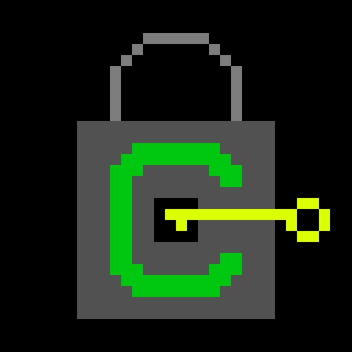

# CRYPTO
Boilerplate code for blockchain cryptocurrencies written in python. In inactive development. Try to hack it!!!!

## Quickstart guide
* Install the dependencies via pip (pip install flask, pip install rsa);
* Run the miner.py script and keep it running;
* Visit 127.0.0.1:5000/
* Generate a keypair by visiting 127.0.0.1:5000/new/
* Talk to some other guys, share IP adresses with each other. Add them to the contacts list (step 6)
* View the instructions given in step 3.

## Info
The currency was created in three days, 4 hours each.

**I don't hold the responsibility for any lost funds.**

## Wow! Icon!

